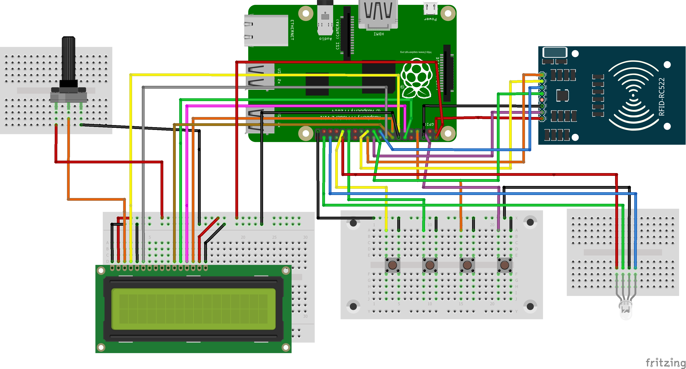

# Payment Terminal Application
**2018 by Tommy Hasert**

This project aims to provide a terminal application for a digital payment system for [HfTL Club](http://club.hft-leipzig.de).

## Development

Checkout the repository and install required NodeJS modules on your Raspberry Pi by executing the following commands:

```
git clone https://github.com/hftlclub/payment-terminal
cd payment-terminal
npm install
```

Setup the database connection and modify some settings in your src/.env file.

Start the server via the following command:

```
npm start
```

## Screenshot

